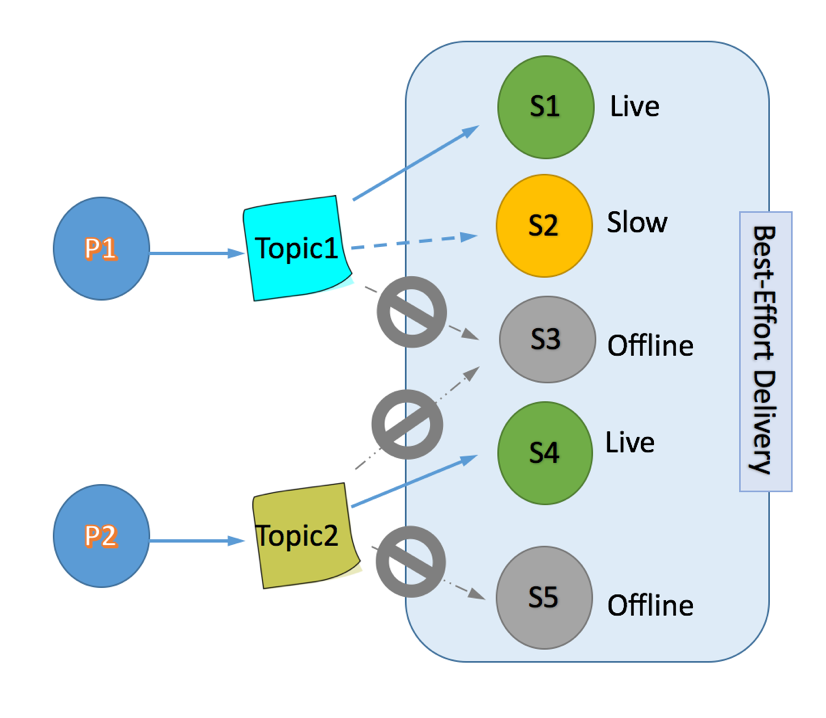
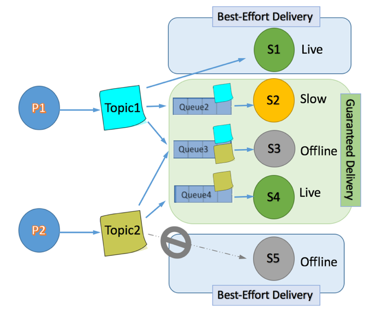

# Solace Demo

## Install Solace PubSub+ on Kubernetes

Helm Chart: https://hub.helm.sh/charts/solace/pubsubplus

Solace PubSub+ broker can be installed on Kubernetes using the following helm command:

~~~
helm install solace solace/pubsubplus --set solace.redundancy=false,solace.usernameAdminPassword=password,storage.persistent=false
~~~

## SpringBoot Doc

Solace SpringBoot documentation with Producer / Consumer sample code (JMS 1.0 over AMQP/AMQPS protocol)
https://solace.com/samples/solace-samples-amqp-qpid-jms1/publish-subscribe/

Solace SpringBoot documentation with Producer / Consumer sample code (JMS 2.0 over AMQP/AMQPS protocol)
https://solace.com/samples/solace-samples-amqp-qpid-jms2/publish-subscribe/

Integration with SpringBoot Documentation (Solace Message Format SMF Protocol) :
https://solace.com/samples/solace-samples-spring/spring-boot-autoconfigure/

In order to connect to Solace broker using JMS 2.0 over amqp / amqps, add the following to Spring Boot application:

(Refer to doc https://solace.com/samples/solace-samples-amqp-qpid-jms2/publish-subscribe/)

## Add Required Dependency
~~~xml
<dependency>
	<groupId>org.apache.qpid</groupId>
	<artifactId>qpid-jms-client</artifactId>
	<version>0.27.0</version>
</dependency>
~~~

## Create a Connection to the Broker

~~~java
ConnectionFactory connectionFactory = new JmsConnectionFactory(solaceUsername, solacePassword, solaceHost);
JMSContext context = connectionFactory.createContext();
~~~

## Initialize Queue or Topic as you need

~~~java
Topic topic = context.createTopic(solaceTopic);
Queue queue = context.createQueue(solaceQueue);
~~~

## Implement a Producer

~~~java
JMSProducer producer = context.createProducer();
producer.setDeliveryMode(DeliveryMode.NON_PERSISTENT);
~~~

## Write Message to Queue / Topic

~~~java
TextMessage message = context.createTextMessage("Hello world!");
producer.send(queue, message);
producer.send(topic, message);
~~~

## Implement a Consumer

(We use JMSContext and and Queue/Topic variables created before. Create new ones when necessary)

~~~java
JMSConsumer consumer = context.createConsumer(queue);
~~~

## Read Messages from Queue / Topic Synchronously

~~~java
String message = null;
while(keepRunning) {
	message = null;
	message = consumer.receiveBody(String.class);
					 
	if(message != null) {
	 	System.out.println("Received Message: " + message);
	 	System.out.flush();
	 } 
	//Sleep
	try {
		Thread.sleep(500);
	} catch (InterruptedException e) {
		System.out.println("Consumer Thread Exit");
	}
}
~~~

## Persistence:
When configuring a producer delivery mode to persistent, we make the call to send() blocking

This makes the send() synchronous and return when the broker has written the message to disk

Synchronous / Persistent send mode has severe impact on performance but offers delivery guarantee

Confirmed Delivery Topic Official Doc:
https://solace.com/samples/solace-samples-amqp-qpid-jms2/confirmed-delivery/

In JMS, when sending persistent messages, the JMS Producer will not return from the blocking send() method until the message is fully acknowledged by the message broker.

This behavior means that applications sending persistent messages using Solace messaging are guaranteed that the messages are accepted by the router by the time the send() call returns. No extra publisher acknowledgement handling is required or possible.

This behavior also means that persistent message producers are forced to block on sending each message. This can lead to performance bottlenecks on publish. Applications can work around this by using JMS Session based transactions and committing the transaction only after several messages are sent to the messaging system. 

Example of Persistence Implementation in Qpid JMS 2.0:
https://solace.com/samples/solace-samples-amqp-qpid-jms2/persistence-with-queues/

**Transactions:**
According to documentation, transactional mode is possible with solace when properly configuring the JMS Session
Doc: https://docs.solace.com/Solace-JMS-API/Using-Transacted-Sessions.htm

**Pushing Messages to Multiple Subscribers:**
* Requires using topics
* By default, a topic will make the message available only for online consumers (if a consumer isn’t online / available) it may not have enough time to consume the message from thee topic

There are 2 techniques to send the same message to multiple destinations (consumers) reliably:

Implement Durable subscriptions:
https://solace.com/samples/solace-samples-amqp-qpid-jms2/feature_DurableTopicSubscriber/

Implement Topic to Queue Mapping:
https://solace.com/samples/solace-samples-amqp-qpid-jms2/topic-to-queue-mapping/

>> Topic to Queue is the easiest approach

>> Refer to this topic on solace forum for comparison between the different approaches
